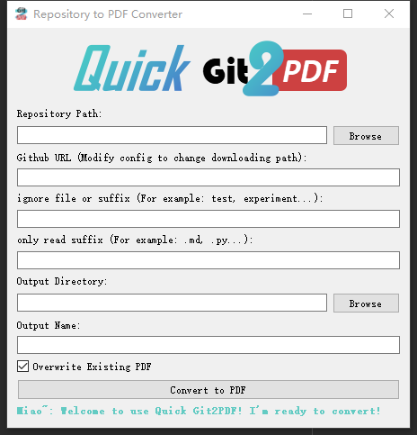

<h2>⚈ About This</h2>
You can easily convert a repository into a PDF by running the `/dist/repo2pdfAPP/repo2pdfAPP.exe` executable. 
To do this, you can either provide the URL of the repository or the path to the downloaded repository. 
The graphical user interface (GUI) for the application is as follows:
# user interface


Alternatively, you can run the Repository2PDF.py script using the command-line interface (CLI). 
The command to do this is as follows:

```bash
python Repository2PDF.py \
    --dir="C:/Users/username/Desktop/Quick-Git2PDF" \
    --output_dir="C:/Users/username/Desktop/Quick-Git2PDF" \
    ...
```

Here are the default configuration options for the application. If you wish to customize the settings, 
you can edit the config.json file located in the `dist/repo2pdfAP` directory.

```json
{
  "wkhtmltopdf": "../wkhtmltopdf/bin/wkhtmltopdf.exe",
  "overwrite": true,
  "num_multiprocess": -1,
  "git_download_path": null,
  "output_name": null,
  "output_dir": null,
  "style": "colorful",
  "icon_path": "logo_4.png",
  "only_read": [],
  "gitignore_flexible_config":
  [
    "index.html",
    "tools",
    "utils",
    "tests",
    "test"
  ]
}
```

This project employs **wkhtmltopdf** for converting HTML to PDF, with the application housed in the **dist** directory. 
To operate the application, ensure **wkhtmltopdf** is work on your system. 
If it's missing, download it from https://wkhtmltopdf.org/downloads.html. Post-installation, 
edit the **config.json** file to reflect the path to the wkhtmltopdf executable, enabling the app to locate and use it correctly.

<h2>⚈ Thanks </h2>
https://img.shields.io/github/stars/Alfareiza/repository-to-pdf

